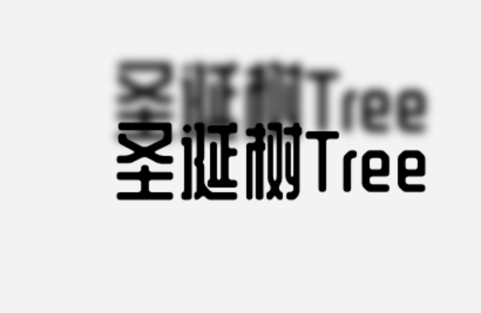
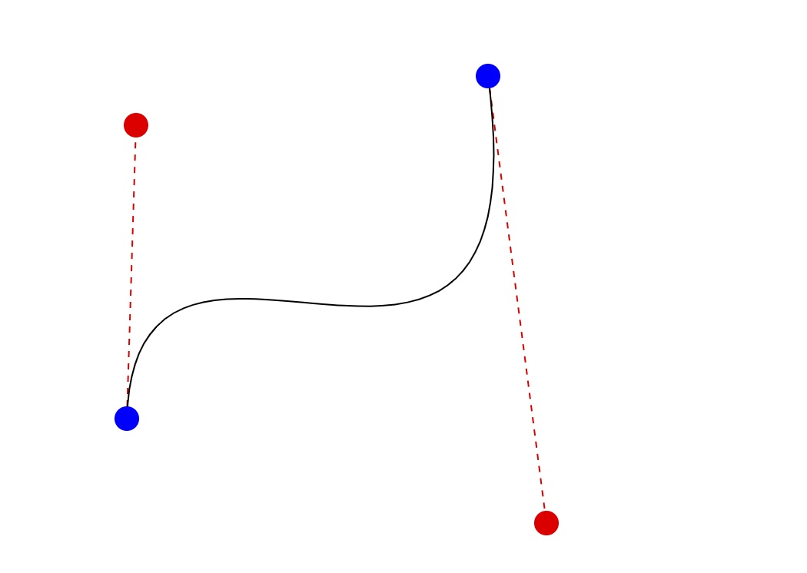
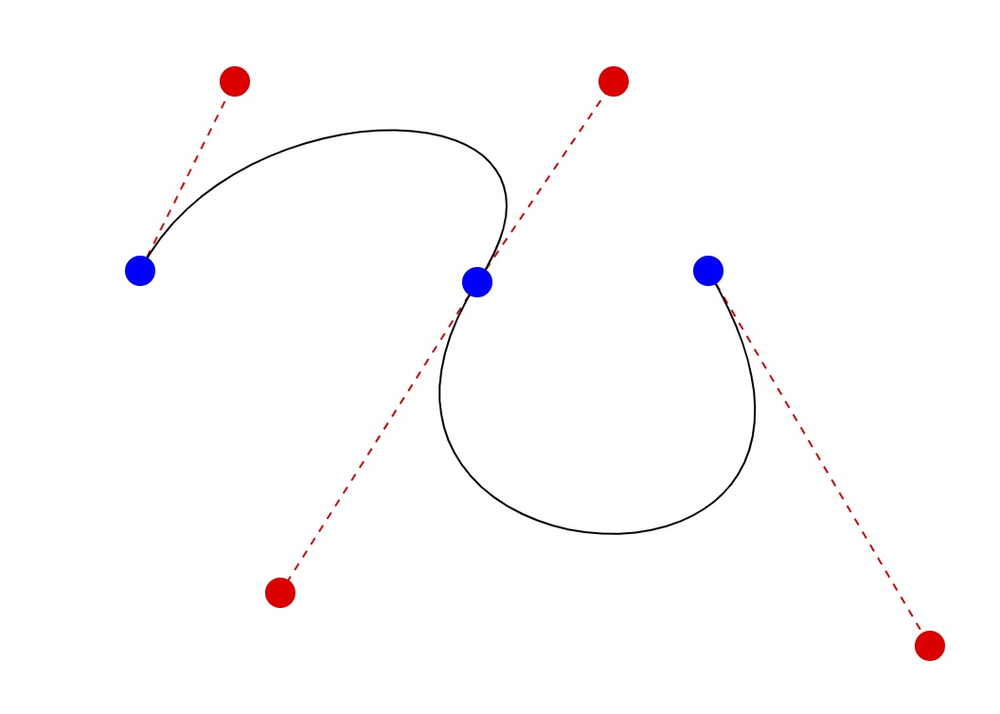
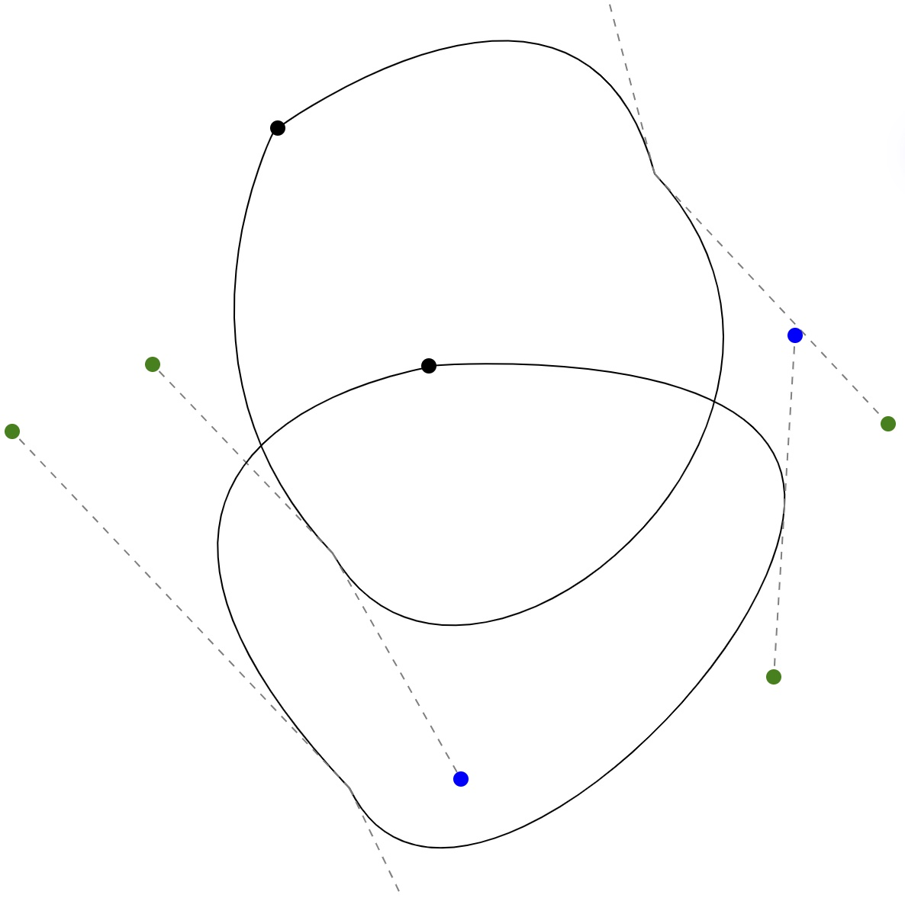

# Canvas Playground

start a server at root path or `pnpm run dev`

## opentype.js 文本文字路径 font/fontShapePathByOpentype

## paperjs 绘制可交互 bezier 曲线

一段三阶 bezier 曲线 bezier/using-paperjs-lib/bezier.html

多段三阶 bezier 曲线 bezier/using-paperjs-lib/two-bezier.html

## paperjs 绘制钢笔工具  bezier/pen

